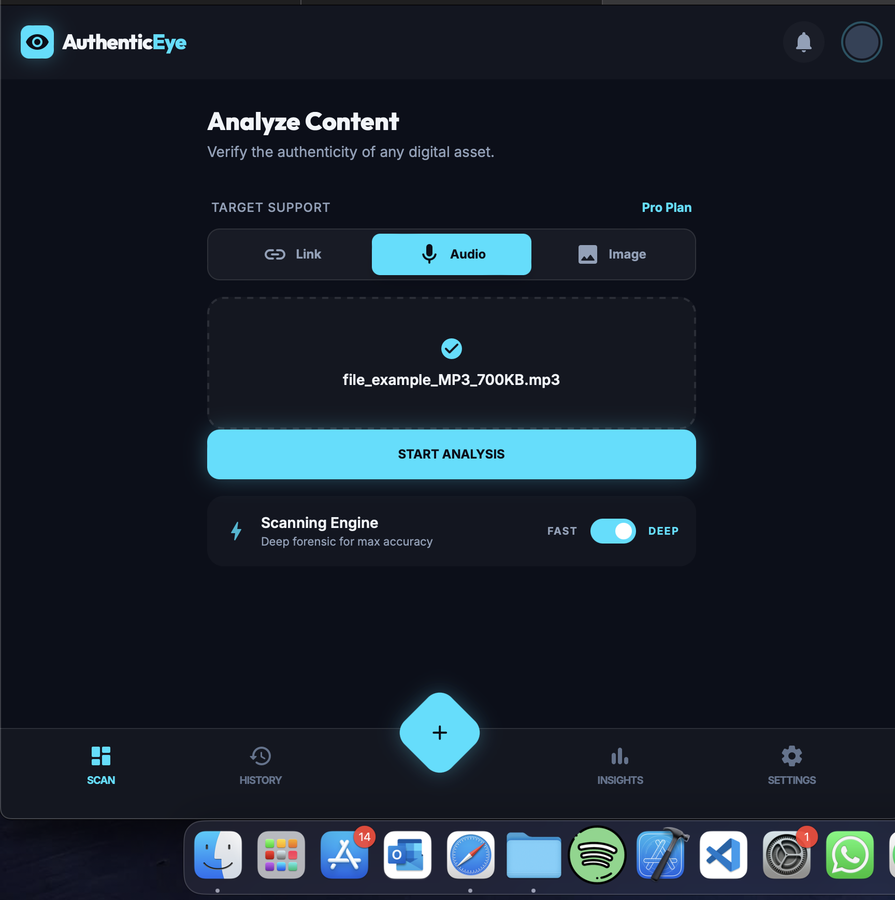
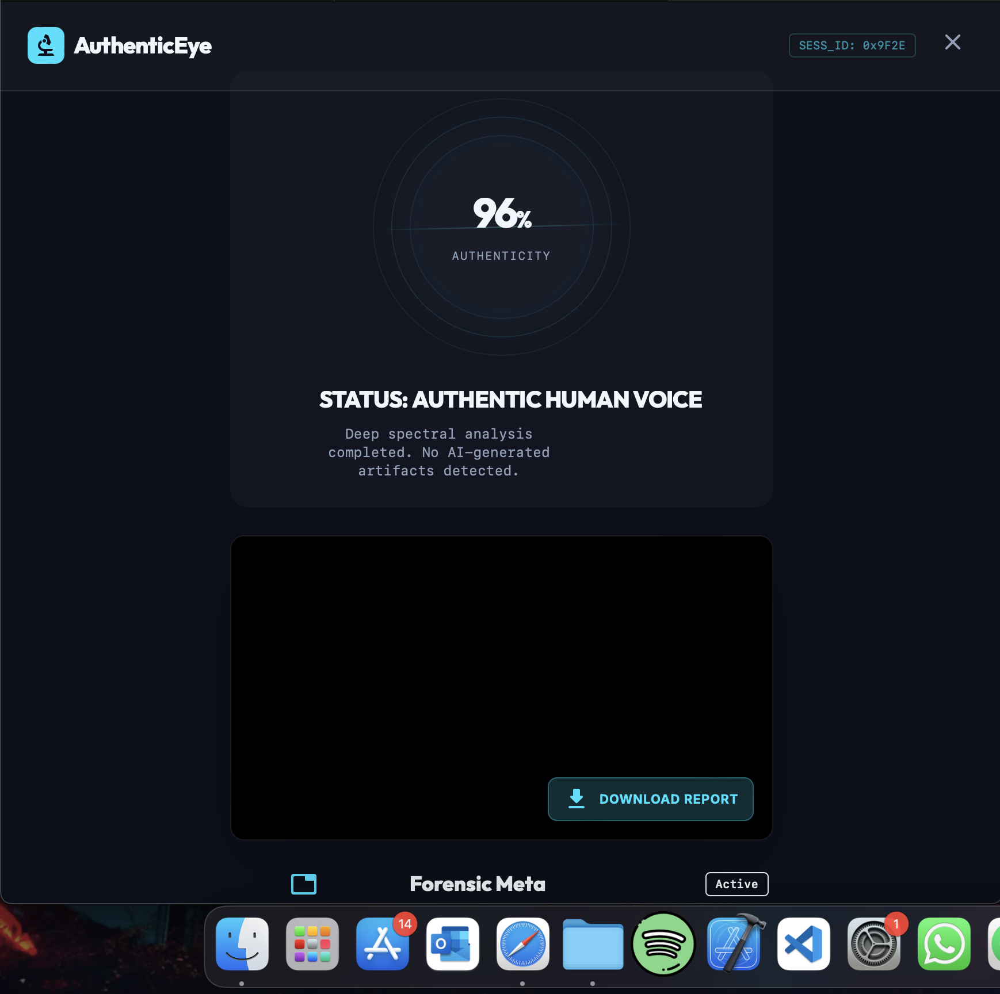
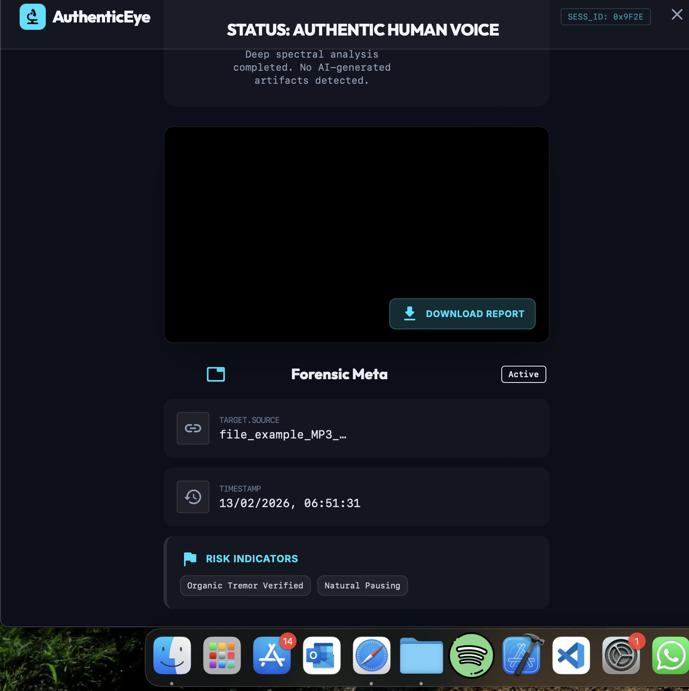

# 👁️ AuthenticEye - AI Content Detector

AuthenticEye is a forensic tool that helps users verify if a website or media is authentic or AI-generated.

## 🚀 Features
- **URL Scanning:** Deep analysis of domain age, SSL, and structure.
- **Visual Heatmap:** Highlights suspicious pixel regions (simulation).
- **Threat Intelligence:** Blocks known malicious/phishing sites instantly.
- **Freemium Model:** Free vs. Pro tier with feature locking.

## 🛠️ Tech Stack
- **Frontend:** React, TypeScript, Tailwind CSS
- **Backend:** Node.js, Express, Puppeteer
- **Database:** Firebase

## 📸 Screenshots

## 📦 Installation

1. Clone the repo
2. `cd server` -> `npm install` -> `node index.js`
3. `cd client` -> `npm install` -> `npm run dev`
